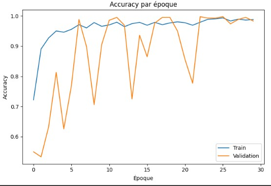
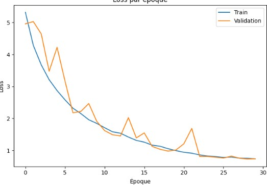
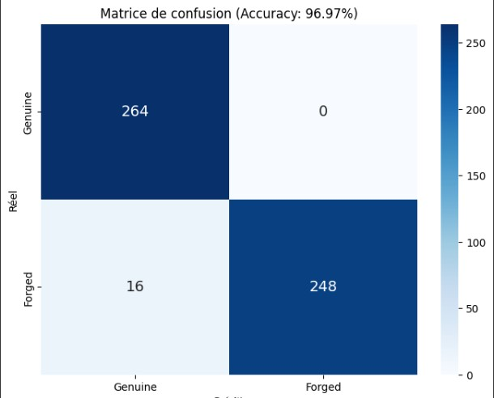

# ✍️ SignatureShiha - Vérification de signature intelligente avec IA

## 🔍 Description

**SignatureShiha** est une application full-stack basée sur l'intelligence artificielle pour la **vérification automatique de signatures manuscrites**.

Le projet est composé de :
- 🎯 Un **frontend Angular** (`angular-auth-app`) pour gérer l'interface utilisateur (connexion, enregistrement, signature, profils).
- 🔧 Un **backend Django** (`django`) exposant une API REST pour gérer les utilisateurs et la classification IA.
- 🧠 Une **intelligence artificielle entraînée** pour distinguer les signatures **authentiques** (genuine) et **fausses** (forged) avec une précision de **96.97%**.

---

## 🚀 Fonctionnalités principales

- Authentification sécurisée
- Gestion des utilisateurs et profils
- Système de signature numérique
- Intégration IA pour validation ou détection de signature

---

---

## 🧠 Détails sur le modèle d'intelligence artificielle

Le cœur de ce projet repose sur un modèle de deep learning basé sur **VGG16**, pré-entraîné sur ImageNet et adapté pour la classification binaire : **signature authentique** (`Genuine`) vs **signature falsifiée** (`Forged`).

### ⚙️ Pipeline IA :
1. **Chargement des données** : images authentiques et falsifiées depuis deux dossiers distincts.
2. **Prétraitement** : redimensionnement, normalisation, encodage One-Hot des classes.
3. **Augmentation des données** : rotation, zoom, translation, retournement horizontal, etc.
4. **Modèle** :
   - Base : `VGG16` (couches gelées sauf les 4 dernières)
   - Ajouts : `GlobalAveragePooling`, `Dense` avec régularisation `L2`, `BatchNormalization`, `Dropout`
   - Sortie : 2 classes avec activation `softmax`
5. **Compilation** :
   - Optimiseur : `AdamW` avec taux d'apprentissage contrôlé
   - Fonction de perte : `categorical_crossentropy`
   - Métriques : `accuracy`, `precision`, `recall`

### 📈 Entraînement :
- **EarlyStopping** : arrêt anticipé si pas d'amélioration sur `val_loss`
- **ReduceLROnPlateau** : réduction du learning rate en cas de plateau
- **ModelCheckpoint** : sauvegarde automatique du meilleur modèle

### 🧪 Évaluation finale :
- Séparation `train/test` avec `train_test_split` (stratifié)
- Affichage de :
  - Rapport de classification (`precision`, `recall`, `f1-score`)
  - Matrice de confusion
  - Graphiques `accuracy/loss` par époque

Le modèle atteint une précision globale de **96.97%**, ce qui démontre une capacité fiable à détecter les signatures falsifiées.

---


## 📊 Résultats IA

### Accuracy & Loss par époque

| Accuracy                          | Loss                             |
|----------------------------------|----------------------------------|
|   |           |

### Matrice de confusion (Accuracy: 96.97%)




---

## 🛠️ Lancement du projet

### ▶️ Frontend Angular

```bash
cd angular-auth-app
npm install
ng serve


